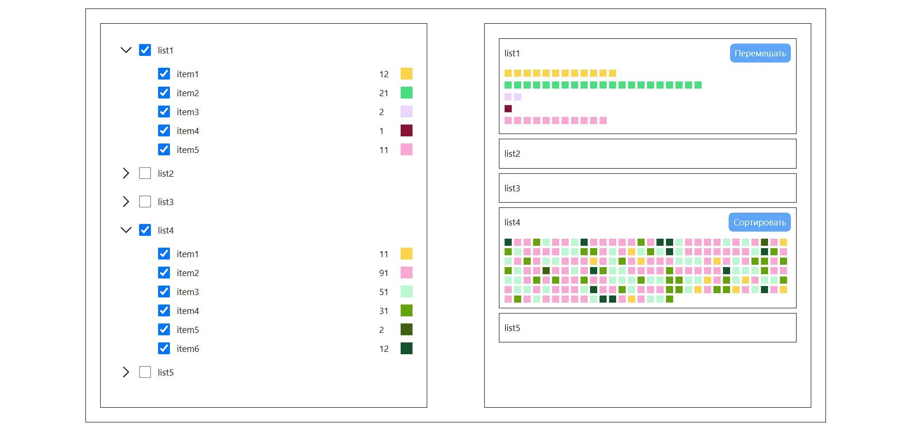

# Тестовое задание

Приложение написано на **Vue** с использованием **Pinia**, **Tailwind CSS**, **Vueuse**.

---

## Функционал

- Возможность выбрать чекбоксом список и вложенные элементы списка
- Изменение количества и цвета в элементе списка
- Возможность перемешать или отсортировать цвета в заданном количестве

---

\

